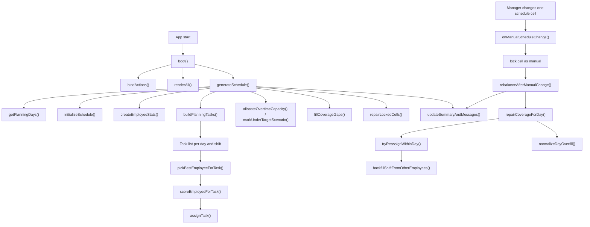

```mermaid
flowchart TD
  A["App start"] --> B["boot()"]
  B --> C["bindActions()"]
  B --> D["renderAll()"]
  B --> E["generateSchedule()"]

  E --> F["getPlanningDays()"]
  E --> G["initializeSchedule()"]
  E --> H["createEmployeeStats()"]
  E --> I["buildPlanningTasks()"]
  E --> J["allocateOvertimeCapacity() / markUnderTargetScenario()"]

  I --> K["Task list per day and shift"]
  K --> L["pickBestEmployeeForTask()"]
  L --> M["scoreEmployeeForTask()"]
  M --> N["assignTask()"]

  E --> O["fillCoverageGaps()"]
  E --> P["repairLockedCells()"]
  E --> Q["updateSummaryAndMessages()"]

  R["Manager changes one schedule cell"] --> S["onManualScheduleChange()"]
  S --> T["lock cell as manual"]
  T --> U["rebalanceAfterManualChange()"]
  U --> V["repairCoverageForDay()"]
  V --> W["tryReassignWithinDay()"]
  W --> X["backfillShiftFromOtherEmployees()"]
  V --> Y["normalizeDayOverfill()"]
  U --> Q
```
